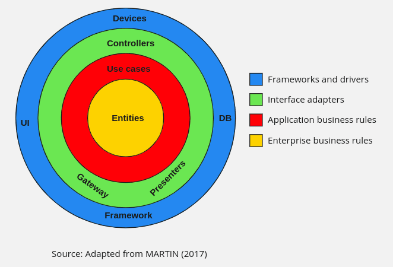

# Grupo 7
- Acad. Cirano Alves Belardony (ciranobelardony@gmail.com)
- Acad. Felipe Alves de Oliveira (prohazor.fa@gmail.com)
- Acad. João Ygor Vieira Ramalho (ygorvieira2002@gmail.com)

# Sobre o projeto
Este projeto foi desenvolvido como parte do Tech Challenge, um desafio técnico que engloba os conhecimentos adquiridos em diversas disciplinas do curso. O objetivo principal é a criação de um Sistema de Reserva e Avaliação de Restaurantes, seguindo os princípios da Clean Architecture e utilizando Spring Boot e seu ecossistema.

## Funcionalidades
A API foi projetada para fornecer as seguintes funcionalidades principais:

Cadastro de Restaurantes:
Os restaurantes podem se registrar no sistema fornecendo detalhes como nome, localização, tipo de cozinha, horários de funcionamento e capacidade.

Reserva de Mesas:
Os usuários podem fazer reservas de mesas para datas e horários específicos, garantindo uma experiência personalizada e controlada.

Avaliações e Comentários:
Após a visita ao restaurante, os usuários podem avaliar a experiência, com a possibilidade de adicionar uma avaliação (nota) e comentários detalhados sobre o serviço e a comida.

Busca de Restaurantes:
Os usuários podem buscar restaurantes no sistema utilizando filtros como nome, localização e tipo de cozinha, facilitando o acesso às opções que melhor atendem às suas preferências.

Gerenciamento de Reservas:
Os restaurantes podem gerenciar as reservas realizadas pelos clientes, com a capacidade de visualizar, atualizar ou cancelar o status das mesas, de acordo com a necessidade.

## Arquitetura
Este projeto foi desenvolvido com base nos princípios da Clean Architecture, garantindo uma separação clara de responsabilidades e promovendo a escalabilidade e a manutenção ao longo do tempo. As camadas principais da aplicação são:

Camada de Domínio: Contém a lógica de negócios (implementadas nos casos de uso), incluindo o cadastro de restaurantes, reservas, avaliações e buscas.
Camada de Aplicação: Exposição da API via endpoints RESTful, permitindo que clientes interajam com o sistema.
Camada de Infraestrutura: Implementações de persistência de dados (usando, por exemplo, JPA e banco de dados relacional) e outras integrações de sistema.



## Tecnologias utilizadas
- Java 17 LTS
- Spring Boot
- Docker
- Postgres
- Mockito
- Gatling
- Makefile
- Maven
- Lombok


# Requisitos para rodar o projeto:
* Docker (https://www.docker.com/)
* Git

Para clonar o projeto, rode o seguinte comando:
```
git clone https://github.com/Tatu-Armadillo/parquimetro
```

# Variaveis de ambiente:
Obs.: Configuração padrão para rodar pelo docker com o banco e aplicação em comunicação pela da network restaurant-review-postgres-network 
```
PORT_APP, DB_SGDB, DB_HOST, DB_PORT, DB_NAME, DB_USER, DB_PASSWORD
```

# Como executar a aplicação:
Rode o comando na pasta raíz da aplicação
```
docker-compose up -d
```

Para acessar o swagger:
```
http://localhost:9090/api/swagger-ui/index.html
```
